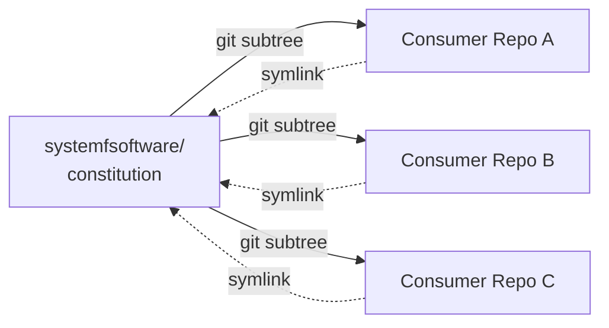

# Constitution

[](LICENSE)
[](https://systemfsoftware.com/constitution)
[](CONSTITUTION.md)

> **Constitution is the design law for teams who want unbreakable code without tools lock-in.**

It binds every repository under [System F Software](https://systemfsoftware.com): a pure functional core behind a thin imperative shell, types before logic, the Testing Trophy, and removal over addition. It is **stack-neutral** — principles, not frameworks — so it governs any codebase, in any language.



One source of truth. Every consumer vendored. Zero drift.

---

## The Problem

Design principles live in CONTRIBUTING.md, ARCHITECTURE.md, PR comments, Slack threads, the senior engineer's head. None of those propagate. A new repo starts from a blank page; an old repo inherits yesterday's opinions; a reviewer enforces a rule nobody else has read. By the fifth service, the codebase has five different architectures and five different definitions of "done."

## The Solution

[`CONSTITUTION.md`](CONSTITUTION.md) is a single document — five articles, thirty-one rules — that every repo under System F Software vendors via `git subtree` and references via symlink. **Amend it once here, and every consumer picks up the new law on its next subtree pull.** No forks. No copies. No drift.

Stack neutrality is the load-bearing constraint: principles stay at the level of *"a state machine hidden in a record"* and *"mutation is the measure,"* not *"use this ESLint rule"* or *"this ORM."* Tools change every year; the laws do not.

---

## Quick Start

Vendor the constitution into your repository as a squashed, signed subtree, then symlink it to the repo root:

```bash
# 1. Fetch into a named ref — a transient FETCH_HEAD silently breaks subtree tracking
git fetch https://github.com/systemfsoftware/constitution.git main:refs/remotes/vendor/constitution

# 2. Vendor it as a squashed, signed subtree
git subtree add --prefix=vendor/constitution refs/remotes/vendor/constitution --squash -S \
  -m "chore: vendor shared constitution"

# 3. Symlink it to the repo root
ln -s vendor/constitution/CONSTITUTION.md CONSTITUTION.md
```

Reference it from your agent harness (`AGENTS.md` or `CLAUDE.md`) so the bound rules are visible to every agent run:

```markdown
@CONSTITUTION.md
```

You should see `vendor/constitution/CONSTITUTION.md` tracked in git, `CONSTITUTION.md` at the root as a symlink, and `git subtree pull` ready to refresh it.

---

## Update a Consumer

```bash
git fetch https://github.com/systemfsoftware/constitution.git main:refs/remotes/vendor/constitution
git subtree pull --prefix=vendor/constitution refs/remotes/vendor/constitution --squash -S \
  -m "chore: update constitution"
```

The symlink never changes — it always points at `vendor/constitution/`, so a pull just refreshes the content underneath.

---

## Articles

| Article | Principle |
| --- | --- |
| **I — The Pure Core** | Decisions are pure; types come first; errors are variants; null is not a state; one path. |
| **II — The Boundary** | Functional core / imperative shell; effects are values; decode never cast; dependencies point inward. |
| **III — Verification** | The Testing Trophy; properties over examples; mutation is the measure. |
| **IV — Organization** | Organized by what it does; names scream the domain; fits in the head. |
| **V — Conduct** | Depth over expedience; challenge before you commit; subtract before you add. |

Each rule is a YAML block with `do`, `dont`, `harm`, and `gate` — machine-readable, agent-discoverable, and ready for property tests over the corpus. Read the full text: [`CONSTITUTION.md`](CONSTITUTION.md).

---

## Amendment

The constitution is amendable by design. An amendment carries a written rationale, a version bump, a date, and a matching update to the consuming `AGENTS.md`. Proposed additions go through challenge first (§V.5) — every rule must name the harm it prevents, and removal is the default response to slop at every scale (§V.7).

---

## FAQ

**Q: Why git subtree + symlink instead of a git submodule?**
A: Submodules pin a commit and surface a detached `HEAD` to anyone cloning — bad for a document every contributor reads on day one. A subtree is just files, and the symlink makes the path stable so `AGENTS.md` can reference `@CONSTITUTION.md` once and never change.

**Q: Why not pin CONSTITUTION.md to a specific version per consumer?**
A: Drift. The whole point of one source of truth is that an amendment here propagates everywhere on the next pull. Pinning would reintroduce the fork-by-copy problem the constitution exists to solve.

**Q: Can a consumer override a rule?**
A: No — that is what an amendment is for. Override-by-fork has been the failure mode for every prior attempt at a shared design law.

**Q: How do I cite a rule in a PR?**
A: By the harm it prevents, not by clause number. §A.1: *"invoke a principle by showing the harm is present."* The rule ids (`I.1`, `II.3`, `V.7` …) are stable for cross-document reference; the prose around them can change.

**Q: Is this only for TypeScript / Effect / a specific stack?**
A: No. The principles are stack-neutral. The harness that enforces them (`AGENTS.md`, lint rules, property tests) lives in each consumer repo and is free to vary by stack.

---

## Contributing

Development workflow, commit conventions, and verification commands: [AGENTS.md](AGENTS.md). This repository has no production code and no build step — the deliverable is the document itself.

## License

[MIT](LICENSE) © 2026 Ryan Lee.
