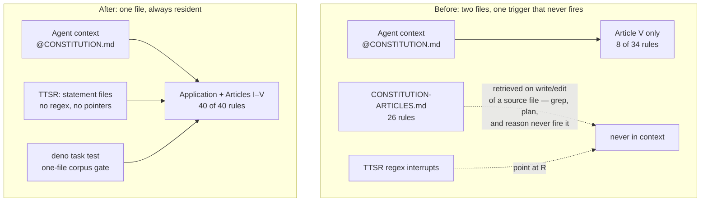

# Restore the Single-Document Constitution - Plan

## Goal Capsule

- **Objective:** An agent in any consumer repo receives the entire constitution — all five articles plus the restored governance teeth — by including exactly one file in context (`@CONSTITUTION.md`), and every delivery surface (corpus, validator gate, TTSR plugin, README, AGENTS.md) states and checks that one-file contract. An outside verifier confirms it with three commands: `deno task test` reports one corpus file, a grep for the second filename over live surfaces returns nothing, and `deno task test --against` fixtures still name the historical vacancies. Non-goal: this amendment fixes presence — the law is in the window — not conformance under compaction; re-pinning before each decision remains the consuming harness's job, and the measured residual decay risk is accepted, not solved.
- **Means:** Merge Articles I–IV into `CONSTITUTION.md` byte-identical, mint six rules (`CONST-T15`, `CONST-G4`, `CONST-E6`, `CONST-E7`, `CONST-E8`, `CONST-G5`), rewrite the corpus gate for one file, and gut the plugin's regex interrupts into residency statements (KTD1–KTD10).
- **Authority:** The invoking directive (carried as labeled settled decisions in this plan). Measured evidence: compaction-driven governance decay — violation 0% with the policy in full context rising to 30% after compaction, 59% worst model, across 1,323 episodes and seven model families (arXiv:2606.22528); prohibition compliance 73% at turn 5 falling to 33% at turn 16 across 4,416 trials (arXiv:2604.20911); re-inserting the policy before the decision restores 0%. Doctrine primaries: Seemann, "AI-generated tests as ceremony" (ploeh.dk, 2026-01-26); Dodds, "Write tests. Not too many. Mostly integration." and "The Testing Trophy and Testing Classifications" (kentcdodds.com). The corpus's own id-surgery law in `AGENTS.md` governs id handling. The base is `origin/main` at `dfa2abc` — the Deno-2-migrated tree (`deno task test`, commitlint via `deno run npm:@commitlint/cli@21`, no `package.json`); its 34-rule corpus is the base being amended, not evidence of correctness (CONST-S2).
- **Stop conditions:** A gate failure not explained by this amendment's own edits; a byte-identity extraction that mismatches during the merge; evidence that a minted id collides with a vacated number's obligation.
- **Execution profile:** A feature branch off `main`; the amendment's commits in order — plan checkpoint; corpus + gate flip as one atomic commit; plugin; harness prose — pushed as one PR; no push to `main`. Prerequisite infrastructure repairs (a pre-existing breakage this run must fix to commit at all) may precede or interleave, each its own commit and declared.
- **Tail ownership:** Branch shipping, PR, and CI watch belong to the calling pipeline. Consumer-repo subtree pulls and any org-tree watchdog citing vacated ids are consumer-owned follow-ups; loud vacancy at their next pull is the intended behavior.

---

## Product Contract

### Summary

Restore the constitution to a single always-resident document. `CONSTITUTION.md` becomes the whole corpus: the five articles plus a restored Application section holding the governance and enforcement teeth that commits #9/#10 removed. The Testing Trophy returns as architecture — an investment order, not a width table. The two-file split, its retrieval delivery contract, and the regex interrupts that pointed at a file agents never load are deleted. The validator is rewritten so the gate measures the corpus it actually has.

### Problem Frame

The split put 26 of 34 rules in `CONSTITUTION-ARTICLES.md` behind a "retrieved on write or edit of a source file" trigger. An agent that greps, plans, or reasons never fires that trigger — the observed failure, not a hypothesis. The mechanism was measured before it failed here: a retrieval gate forces presence of a document, never conformance to it, and every rule it holds decays with compaction depth (arXiv:2606.22528; arXiv:2604.20911). Residency is the pin; retrieval is hope.

The TTSR plugin rules made the same bet a second time: regex interrupts (`throw new Error`, `jest.mock`, the word "characterization") scoped to `tool:edit`/`tool:write` of test-file globs — an enumerated intercept set that grep, plan, and review turns never enter — telling the model to consult a file that is not in context. The interrupt is not a gate; a stream rule that cannot fail the defect it names violates the recomputed-key law the corpus itself states (CONST-E5).

The August 29 rehaul cut real architecture along with the refuted parts. Its dossier refuted trophy widths as an enforceable number, mocked composition as a mandated band, and characterization as a standing duty — it did not refute the investment order, the sandwich, the types, or independent oracles. This amendment restores the architecture and leaves the refuted doctrine dead.

### Key Decisions

- **One resident document; the articles file is deleted.** (session-settled: user-directed — chosen over keeping the split with better retrieval wiring: law that is not in the window is not law, and the compaction measurements show retrieval-resident law decays silently) Governs R1, R6, R7, R8.
- **Mint new ids; vacated numbers stay vacated forever.** `CONST-T1/T2/T5`, `CONST-G1/G2`, `CONST-E1–E4` are never resurrected. (session-settled: user-directed — chosen over restoring the old ids: the corpus's own id-surgery law makes a vacated number permanent) Governs R3, R4, R5.
- **The trophy returns as investment order, not widths.** Static analysis first, properties where CONST-T14 grants them, composition through the sandwich, contracts at the published edge; widths are not a gate; a pyramid of helper units is forbidden. No width table, no layer bars. Characterization-as-duty and blanket properties stay dead — CONST-T14's narrow grant governs. (session-settled: user-directed — chosen over restoring old CONST-T1 verbatim: the dossier refuted the widths and the mandates, not the order) Governs R3.
- **CONST-T9, CONST-T10, CONST-T14, CONST-E5 stay live and byte-identical.** Oracle independence and recomputed gate keys are the load-bearing verification law for machine-authored code. (session-settled: user-directed — chosen over touching them: they are the surviving half of the doctrine) Governs R2.
- **CONST-E3 ("A Gate Earns Its Place") is not restored in this pass.** (session-settled: user-directed — chosen over restoring it: that rule is the mechanism by which the Application section accreted into cargo) Governs R4.
- **The amendment lands as its own commit series; prerequisite repairs are declared separately.** Consumer subtree pulls and org-tree watchdog updates are follow-ups; vacancy at their next pull is the intended loud failure. (session-settled: user-directed — chosen over a wider blast radius: consumer repos must fail loudly at their own pulls)

### Requirements

- R1. `CONSTITUTION.md` contains the entire corpus — the restored Application section plus Articles I–V — and `CONSTITUTION-ARTICLES.md` is deleted from the tree. Check: `deno task test` success line reports exactly 1 file; `git grep -nI 'CONSTITUTION-ARTICLES' -- ':!docs/plans'` prints nothing.
- R2. Every one of the 34 live rules passes through the merge byte-identical (YAML entry text unchanged; only its position in the file changes). Check: a throwaway per-id extraction diff against `origin/main` for all 34 ids, re-read from disk after the write.
- R3. `CONST-T15` "The Testing Trophy" is minted at the head of Article III: investment order static → properties where CONST-T14 grants them → composition through the sandwich (CONST-B3) → contracts at the published edge; widths are not a gate; a Test Pyramid of helper unit tests is forbidden. Check: `deno task test` parses it; the corpus contains no width bars and no layer table; review reads the order and its two citations resolve.
- R4. Five governance rules are minted into a restored Application section, in the pre-#9 order minus CONST-E3 (old order G1, E1, E3, E4, E2, G2 at `ebd9b10~1`): `CONST-G4` (old G1 body), `CONST-E6` (old E1 body with the "at the price CONST-E3 sets" clause removed), `CONST-E8` (old E4 body), `CONST-E7` (old E2 body), `CONST-G5` (old G2 body with its `(CONST-E1)` citation repointed to `CONST-E6`). Check: per-id extraction diff against `ebd9b10~1` modulo exactly those two declared edits; `deno task test` reports no dangling citation.
- R5. Vacated ids appear nowhere as live ids or citations: `CONST-T1/T2/T5`, `CONST-G1/G2`, `CONST-E1–E4`. (`CONST-T6`/`CONST-T7` are vacant, never vacated — no commit in history ever minted them, so they are absent by construction, not by this amendment.) Check: `deno task test --against 9654836~1` — the pre-split single-document revision, where every historical vacancy lived in the one corpus file — names exactly `CONST-E1, CONST-E2, CONST-E3, CONST-E4, CONST-G1, CONST-G2, CONST-T1, CONST-T2, CONST-T5` vacated; `deno task test --against ebd9b10~1` names exactly the six Application-removal ids; both exit 0.
- R6. `scripts/validate-constitution.ts` is rewritten for the one-file corpus at all three sites that name the corpus paths — the shebang's `--allow-read`, the `deno.json` `test` task's `--allow-read`, and `PATHS` — and the header comment teaches the one-file corpus while preserving every check: fenced-YAML coverage, declared-vs-parsed id accounting, schema fields, family registry, gate values, duplicate ids, citation resolution, `--against` title-keyed reassignment, vacated-id and uncompared-file reporting, and the vacuous-pass doctrine (a missing input is fatal; a present input must contribute rules). Check: `deno task test`; `deno lint` on the script; the dangling-citation probe fails as required.
- R7. The plugin's `constitution-pure-core.md`, `constitution-boundary.md`, and `constitution-verification.md` rule files carry no regex conditions and state the residency contract: the constitution is one file, already in context, apply the article. `constitution-conduct-review.md` keeps its mechanically-detectable downgrade/bypass conditions. `plugins/constitution/README.md` teaches the same. Check: the three files contain zero `condition:` patterns; both plugin manifests remain valid JSON and unchanged.
- R8. `README.md` and `AGENTS.md` teach the one-file contract: one symlink in quick start, the file-split sections removed, the delivery table collapsed, the badge recomputed to the validator's count. Check: grep sweep per R1; badge number equals the `deno task test` recomputed rule count.
- R9. Delivery: feature branch off `main`, the amendment's commits in order (plan checkpoint; corpus + gate flip; plugin; harness prose), one PR, no push to `main`. Each message passes the `commit-msg` hook as it lands; the battery re-runs the range. Check: `deno run --allow-read --allow-env --allow-run --allow-sys npm:@commitlint/cli@21 --from <first-commit>~1` exits 0; `git status --porcelain` empty.

### Success Criteria

- `deno task test` exits 0 with `valid: 40 rules across 6 yaml blocks in 1 files, 9 families` (measured; 34 live + 6 minted; no `FAMILIES` registry entry added — all six mints land in existing letters, so the 9 is recomputed from the unchanged registry).
- All three `--against` fixtures in the Verification Contract behave as specified — vacancies named exactly, no reassignment, exit 0.
- The byte-identity battery reports 34 identical live rules and 5 restored rules matching `ebd9b10~1` modulo the two declared edits.
- The dangling-citation probe (a temporary citation to `CONST-T1`) fails the gate naming the citation, then passes after revert — the gate demonstrably bites on this corpus.

### Scope Boundaries

In scope: `CONSTITUTION.md`, `CONSTITUTION-ARTICLES.md` (deleted), `scripts/validate-constitution.ts`, `deno.json`, `plugins/constitution/rules/*.md` (three gutted, one untouched), `plugins/constitution/README.md`, `README.md`, `AGENTS.md`, `CLAUDE.md` (only if it references the deleted filename), this plan.

### Deferred to Follow-Up Work

- Consumer repos' subtree pulls and any org-tree watchdog still citing `CONST-T1`/`CONST-T2`/`CONST-T5` or the two-file contract. Loud vacancy at their next pull is the designed failure; their repair is theirs.
- `CONST-E3`-derived gate-budget doctrine, if ever wanted again, is a future amendment with a fresh id and its own case.
- Historical plans under `docs/plans/` keep their references to the old filename and vacated ids — they are records of what was decided then, not live surfaces, and are excluded from the sweep.

---

## Planning Contract

### Key Technical Decisions

- KTD1. **One resident file is the delivery contract.** (session-settled: user-directed — chosen over progressive disclosure: a retrieval gate forces presence, not conformance, and compaction drops non-resident law at measured rates) The merge is a move, not a rewrite: Articles I–IV blocks are copied byte-identical, their headings and `---` separators preserved, and the articles file's own preamble (its "Retrieved, not resident" contract) dies with the file. Governs R1, R2.
- KTD2. **Mint, never resurrect.** The corpus's id-surgery law: an obligation that narrowed, widened, or moved takes a fresh id; a vacated number is never reused. The six mints are permanent costs accepted per rule. Governs R3, R4, R5.
- KTD3. **T15 is authored fresh, in the corpus's rule schema, citing only live ids.** `gate: review` (the value the vacated trophy carried). Its `do` states the order and names CONST-T14 as the grant for the properties band and CONST-B3 as the sandwich; its `dont` forbids the refuted instruments by concept — a mandated numeric layer width, a layer-naming table, the helper-unit pyramid — and must not contain the literal substrings the trophy-instrument sweep scans for (the `█` bar glyph and `layers:`), so rule text and sweep agree without self-matching. No layer table returns. Placement: head of Article III, the position the trophy occupied before vacancy. Governs R3.
- KTD4. **Restored rule bodies are byte-identical except where they cite vacated ids.** Old E1's `do` carries "at the price CONST-E3 sets" — E3 stays dead, so the clause is removed and CONST-E6's `do` reads, in full: `make any principle that can fail a command — type error, lint rule, mutation threshold, dependency check — fail that command; a failing build is the final word`. Old G2's `do` cites `(CONST-E1)` — repointed to `CONST-E6`, the restored rule carrying that obligation. Both edits are declared here and nowhere else changes. The dangling-citation gate mechanically enforces this decision. Governs R4.
- KTD5. **Layout restores the pre-split shape minus what carried no obligation.** `# Constitution` → `## Application` (five minted rules) → Articles I–V — the exact heading sequence of the last single-document revision, `9654836~1:CONSTITUTION.md` (Preamble → Application → Articles I–V, all rules in one file). The pre-split document's Preamble is not restored: framing prose is not law, and the delivery contract lives in README/AGENTS.md where a harness author reads it. CONST-E5 stays as Article III's terminal rule — moving it is churn with no obligation change. Governs R1, R4.
- KTD6. **The validator keeps every check; only the corpus contract changes.** The two-file union commentary dies; the vacuous-pass doctrine it taught (missing input fatal, present-but-empty fatal, vacancies and uncompared files named on the success line, `--against` reassignment recomputed from git) is preserved verbatim in behavior. `--against` semantics, measured on this branch: the cross-revision arm reads `PATHS` at the compared revision, so common ids compare by title, merged ids are new-at-HEAD growth and pass silently, and a file absent from `PATHS` is never reported uncompared. The narrowing this buys: a vacancy that lived in a file outside `PATHS` at the compared revision is invisible — `--against a8f6b62~1` names nothing for `CONST-T1/T2/T5` because at that revision they lived in the articles file. Vacancy evidence therefore anchors on revisions where the corpus was one file: `9654836~1` (pre-split) names all nine historical vacancies; `ebd9b10~1` names the six Application-removal ids that lived in the resident file. Governs R6, R5.
- KTD7. **TTSR gut shape: statement files, zero regex.** The three craft rule files become frontmatter-plus-statement: residency declared, article applied, no `condition:` patterns. The loader's accepted frontmatter shape is resolved before the plugin commit — from the host's plugin documentation or a local `omp plugin link` probe — not discovered mid-commit. If the loader demonstrably rejects condition-less rule files, the fallback is deleting the three files and carrying the statement in `plugins/constitution/README.md` plus the surviving conduct rule; that fallback narrows the plugin's enforcement surface to conduct only, so it is surfaced to the calling pipeline as a decision before it commits, never buried in a commit body. `constitution-conduct-review.md` is untouched: its conditions detect review-conduct language, which is mechanically observable and points at rules that are resident. Governs R7.
- KTD8. **The gate flip and the corpus merge are one atomic commit.** The gate reads the corpus, so no legal intermediate commit exists: validator-first leaves `PATHS` naming one file while `CONST-T9` — cited twice by the live CONST-S4 — still lives only in the articles file, and the dangling-citation check fails the `pre-commit` hook; corpus-first leaves `PATHS` naming a deleted file, a hard failure by the gate's own missing-input doctrine. Both flips land together, and every commit on the branch is then a full, honest pass of the gate over the corpus it declares. Governs R9.
- KTD9. **The plan checkpoint is commit 1; no dialogue document is copied into the repo.** The invoking directive reaches this plan as labeled settled decisions in the plan's own voice — repo law forbids plans carrying quoted directives or session narrative, and git history preserves the conversation's outcome in the commit trail. Governs R9.
- KTD10. **Challenge record (CONST-W2).** The restore was challenged before commitment under an inversion lens — invert the goal to "delete the articles entirely, keep conduct only" and test which structure survives. The inversion dies on the doctrine's own endgame: types that refuse illegal states (Article I), a thin impure shell around a pure core (Article II), and observers the machine cannot author both sides of (Article III) are precisely the articles the inversion would delete. The lens killed three restorations: the Preamble (framing, not obligation), CONST-E3 (the accretion mechanism), and the width table (refuted instrumentation). The challenge outcome is recorded here with the decision.

### Id surgery map

| Action | Id | Title | Source of body text |
|---|---|---|---|
| Mint | CONST-T15 | The Testing Trophy | authored fresh (KTD3) |
| Mint | CONST-G4 | By Purpose, Not Quotation | `git show ebd9b10~1:CONSTITUTION.md`, old CONST-G1 |
| Mint | CONST-E6 | Prefer the Gate | old CONST-E1 minus the E3-price clause (KTD4) |
| Mint | CONST-E7 | Evidence Before Done | old CONST-E2, byte-identical |
| Mint | CONST-E8 | The Evaluator Is Not the Agent's to Edit | old CONST-E4, byte-identical |
| Mint | CONST-G5 | Supreme | old CONST-G2, E1 citation repointed (KTD4) |
| Keep, byte-identical | 34 live ids | — | `origin/main` |

Base: 34 rules. Post-amendment: 34 + 6 = 40, across 6 yaml blocks in 1 file.

### High-Level Technical Design

Delivery contract, before and after:

### Assumptions

- A1. **Residency scales to a 40-rule document.** The compaction measurements (arXiv:2606.22528; arXiv:2604.20911) are per-policy and per-prohibition; extending them to a merged engineering constitution assumes rule count does not flip the effect. Nothing measured contradicts it — rules visible in full context held at 0% violation — and the alternative was measured to fail here. Warrant: measurement, extrapolated in count. The accepted cost, measured from the working tree: the merged file is ~24.7KB (~6.2K tokens) loading every session, against ~1.3K tokens resident today. The unmeasured edge this assumption carries: at some document scale a model attends to a fraction of a long resident context, making presence stop implying observance — no measured threshold exists for that cliff, and the studies' policy sizes are not reported at a comparable scope.
- A2. **The restored rules compose with the post-August corpus.** Old E1 priced gates by E3's budget (dead), and old G2 deferred to E1's gate supremacy — the two citation surgeries in KTD4 are the full reconciliation. Verified mechanically by the dangling-citation gate and by review of each restored rule against the live set.
- A3. **The plugin loader accepts statement rule files** (no `condition:` patterns, or an empty condition list). Unverified schema detail; resolved at implementation with the KTD7 fallback if it fails.

Destructive review record (required by the pre-plan gate): three assumptions surfaced (A1–A3 above); lens **Inversion**, rotated into this first cycle for this artifact because the change restores old structure wholesale and the live risk is cargo-culting the past; outcome — full residency of Articles I–IV survived the inversion (the endgame sentence is those articles), while the Preamble, CONST-E3, and the width table were killed by it and stay dead. Kills are recorded in KTD5, the Key Decisions, and R3 respectively.

### Risks & Dependencies

- Consumer repos citing vacated ids or the deleted filename fail loudly at their next vendor pull. Intended; follow-up owned by consumers (Scope Boundaries).
- The badge and AGENTS.md counts are recomputed from the validator's own output at implementation, never copied from this plan — the plan's 40 was a prediction until the gate measured it.
- `deno.lock` needs no amendment-driven change: `@std/yaml` and the `--allow-run=git` grant are unaffected by the corpus path change, and the read scopes shrink only.
- The corpus-contract change narrows what `--against` can see (KTD6): vacancies that lived in the articles file are only provable against pre-split-era revisions. Measured, accepted, and encoded in R5's fixtures rather than patched into the gate — a redesign of the cross-revision arm is its own amendment.

---

## Implementation Units

### U1. Plan checkpoint commit

**Goal:** This plan is the first commit on the feature branch.

**Requirements:** R9 (partial)

**Dependencies:** none

**Files:** `docs/plans/2026-09-01-0454-refactor-restore-single-constitution-plan.md`

**Approach:**

1. Create the feature branch off `main`.
2. Commit this file as `docs(plans): checkpoint the single-document restore plan`.

**Patterns to follow:** the existing `docs/plans/` checkpoint convention.

**Test scenarios:** Test expectation: none — a documentation checkpoint with no behavioral surface; the commit itself and commitlint in U5 are the checks.

**Verification:** commit exists on the branch and passes commitlint in U5's battery.

### U2. One-file corpus and gate — one atomic commit

**Goal:** One document carries all 40 rules, the articles file is gone, and the gate measures exactly that corpus — flipped in the same commit.

**Requirements:** R1, R2, R3, R4, R5, R6

**Dependencies:** none

**Files:** `CONSTITUTION.md`, `CONSTITUTION-ARTICLES.md` (deleted), `scripts/validate-constitution.ts`, `deno.json`

**Approach:**

1. Extract each article block from `CONSTITUTION-ARTICLES.md` byte-identical (rules, headings, separators); discard the file's own preamble lines.
2. Assemble `CONSTITUTION.md`: title → `## Application` (G4, E6, E8, E7, G5 in that order) → Articles I–IV blocks → the existing Article V block unchanged.
3. Author `CONST-T15` per KTD3 and place it first in Article III.
4. Apply the two KTD4 citation edits to the restored E6/G5 bodies.
5. Validator: `PATHS` becomes the single-file tuple; the shebang's `--allow-read` drops the articles filename; the `deno.json` `test` task's `--allow-read` drops it too; the header comment is rewritten to teach the one-file corpus while keeping the coverage-before-schema rationale, the vacuous-pass doctrine, the vacancy-not-enforced-but-named rationale, and the `--against` reassignment rationale. Every listed check in R6 is preserved; the per-path contribution requirement stays (trivially one path, still fail-closed if the file parses but declares nothing).
6. Delete `CONSTITUTION-ARTICLES.md`. Commit the whole flip as one `refactor(constitution)!:` commit.

**Execution note:** This is a gate rewrite riding a corpus merge, not a feature — prove it with the known-bad fixtures in the Verification Contract, including one temporary dangling citation, and read the failure text before trusting green. Byte identity is proven by recomputation, not re-reading: for each of the 34 live ids, extract its YAML block from `git show origin/main:CONSTITUTION.md` or `git show origin/main:CONSTITUTION-ARTICLES.md` (whichever file carried it at `origin/main`) and diff against the same-id block in the new file; for each of the five restored Application rules, extract from `git show ebd9b10~1:CONSTITUTION.md` and diff allowing only the two KTD4 edits. A mismatch stops the run.

**Test scenarios:**

- `deno task test` at this commit: exit 0, one file, minted ids parse, families/gates registered, no dangling citations — including the CONST-S4 → CONST-T9 citation, which now resolves in-file.
- Empty-corpus probe: temporarily strip the yaml blocks from the working-tree `CONSTITUTION.md` → gate fails declaring no rules; revert.
- Byte-identity battery: 34/34 identical; restored five match `ebd9b10~1` modulo KTD4's two edits.
- Vacancy fixtures: `--against 9654836~1` names exactly the nine historical vacancies; `--against ebd9b10~1` names exactly the six Application-removal ids.

**Verification:** all four scenario groups pass at this commit; `deno lint` clean on the validator.

### U3. (absorbed into U2)

The former U3 content moved into U2 — the gate flip and the corpus merge are one atomic change (KTD8). The U-ID stays vacant; gaps are fine and nothing renumbers.

### U4. Harness prose and plugin statements

**Goal:** Every delivery surface teaches one file; the regex interrupts stop pointing at a file that no longer exists.

**Requirements:** R7, R8

**Dependencies:** U2 (surfaces describe the final corpus)

**Files:** `README.md`, `AGENTS.md`, `CLAUDE.md` (expected no-op — it references `@AGENTS.md` only; touch it only if it names the deleted file), `plugins/constitution/rules/constitution-pure-core.md`, `plugins/constitution/rules/constitution-boundary.md`, `plugins/constitution/rules/constitution-verification.md`, `plugins/constitution/README.md`

**Approach:**

1. README: replace the two-files section with the one-file contract; one symlink in quick start; collapse the delivery table; drop the path-scoped-rule wiring step; recompute the badge from the validator output; keep the plugin install step.
2. AGENTS.md: repo description to one document; the File Split subsection replaced by the one-file statement; verification-command commentary updated to one file.
3. Plugin: per KTD7 — resolve the loader's accepted frontmatter shape first (host plugin docs or a local link probe), then make the three rule files statement files with no conditions; plugin README rewritten to the residency contract; conduct rule untouched. If the loader rejects statement files, invoke the KTD7 fallback and surface it to the calling pipeline before committing. The plugin lands as its own commit; the prose as the fourth.

**Test scenarios:**

- Sweep: `git grep -nI 'CONSTITUTION-ARTICLES' -- ':!docs/plans'` → zero lines.
- Plugin: zero `condition:` entries in the three gutted files; both manifests parse as JSON and are unchanged.
- Badge equals the gate's recomputed count.

**Verification:** scenarios pass; no stale two-file prose remains on any live surface.

### U5. Full verification battery and commits

**Goal:** Every check in the Verification Contract runs green in order, and the amendment's commits stand.

**Requirements:** R1–R9

**Dependencies:** U1, U2, U4

**Files:** none new

**Approach:**

1. Run the Verification Contract top to bottom on the branch head.
2. Confirm the commitlint range (each commit already passed the `commit-msg` hook at its own creation; this re-runs the range) and a clean tree.

**Test scenarios:** the Verification Contract is the scenario list.

**Verification:** all rows pass; branch is ready for the calling pipeline's shipping tail.

---

## Verification Contract

| Check | Command / method | Exit criterion |
|---|---|---|
| Corpus gate | `deno task test` | Exit 0; success line reports 40 rules across 6 yaml blocks in 1 files, 9 families |
| Byte identity | per-id extraction: 34 live ids diffed against the `origin/main` file that carried each; 5 restored ids against `ebd9b10~1:CONSTITUTION.md` | 34 live rules identical; 5 restored match modulo the two declared KTD4 edits |
| Vacancy — pre-split single document | `deno task test --against 9654836~1` | Exit 0; names exactly CONST-E1, CONST-E2, CONST-E3, CONST-E4, CONST-G1, CONST-G2, CONST-T1, CONST-T2, CONST-T5 vacated |
| Vacancy — Application removal | `deno task test --against ebd9b10~1` | Exit 0; names exactly CONST-E1, CONST-E2, CONST-E3, CONST-E4, CONST-G1, CONST-G2 vacated |
| Reassignment | `deno task test --against <the plan-checkpoint commit>` | Exit 0; no id reassigned; zero ids vacated |
| Dangling-citation probe | temporarily cite CONST-T1, run `deno task test`, revert | Fails naming the dangling citation; green after revert |
| Filename sweep | `git grep -nI 'CONSTITUTION-ARTICLES' -- ':!docs/plans'` | Zero lines (git grep exits 1 when clean) |
| Trophy-instrument sweep | grep the corpus for the `█` glyph and the literal `layers:` | Zero matches (T15's own text avoids both by KTD3) |
| Vacated-id sweep | grep live surfaces for `CONST-T1`, `CONST-T2`, `CONST-T5`, `CONST-G1`, `CONST-G2`, `CONST-E1`–`CONST-E4` | Zero matches outside `docs/plans/` |
| Plugin shape | grep `condition:` in the three gutted rule files; parse both manifests | Zero condition entries; JSON valid |
| Lint | `deno lint` on the validator | Clean |
| Commit format | `deno run --allow-read --allow-env --allow-run --allow-sys npm:@commitlint/cli@21 --from <first-commit>~1` | Exit 0 (each commit already passed the commit-msg hook individually) |
| Clean tree | `git status --porcelain` | Empty |

---

## Definition of Done

- All Verification Contract rows pass on the branch head, in the current session, with output recorded.
- `CONSTITUTION.md` is the only corpus file; 40 rules; the six mints present; the 34 live rules byte-identical.
- The amendment's commits exist in the specified order on a feature branch, commitlint-clean, working tree clean, nothing pushed to `main`. Prerequisite infrastructure repairs, where the base branch was broken, are separate declared commits.
- Residuals (consumer pulls, watchdog citations) are recorded as follow-ups by the calling pipeline, not left as silent scope.
